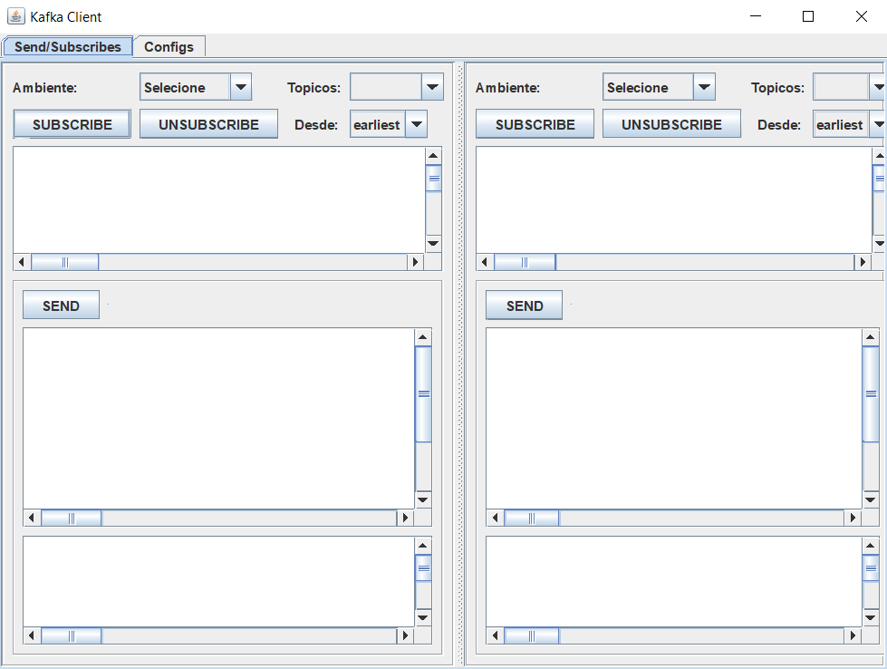
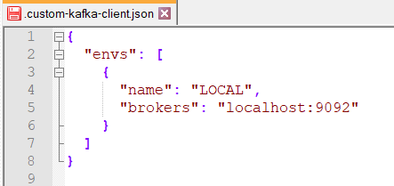

## Kafka Client

* Aplicativo em swing para conectar, ler, postar mensagens no kafka.

Tela Inicial

Arquivo de configurações no home do usuario logado

### Features
* subscribe
* unsubscribe
* post message
  * Replace macro #UUID por UUID randomico do java

##### Esta em desenvolvimento, aceito pullrequests
* A regra é, 
* mantenha o código simples, 
* mantenha uma tela para uso 
* mantenha uma tela para configuracoes/logs(em desenvolvimento).

